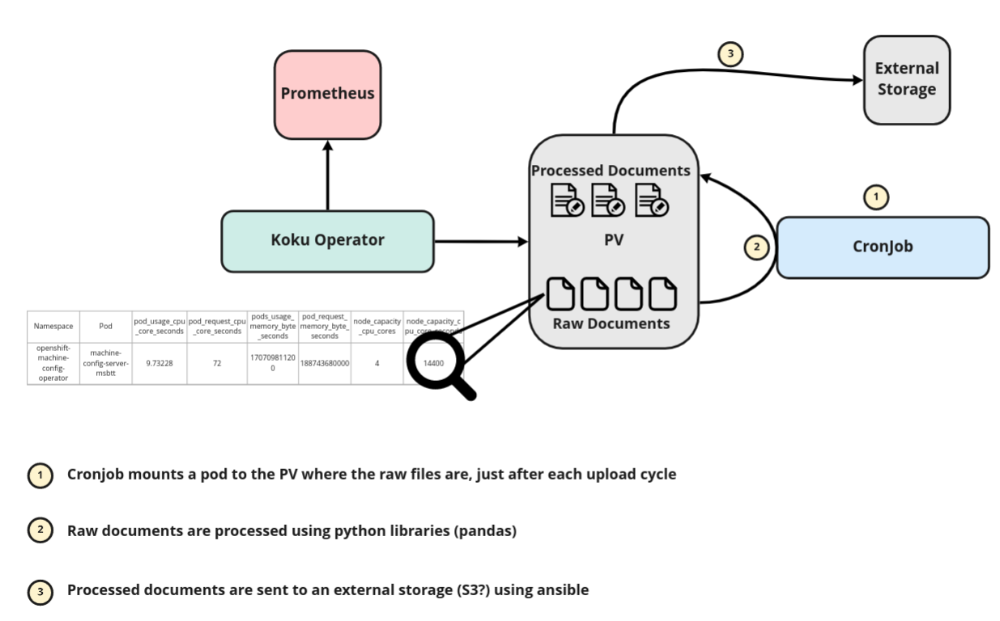

# OpenShift 4 Metering alternative 
This github repository contains kubernetes resources to run a daily Cronjob and a python scripts to process/format the metering data generated by the Koku operator.

This repository doesn't handle the koku operator installation.

## About Koku

The koku-metrics-operator is a component of the cost management service for OpenShift, used to gather the required information from the cluster. This operator obtains OpenShift usage data by querying Prometheus and uploads it to cost management to be processed. The Operator queries Prometheus every hour to create metric reports, which are then packaged and uploaded to cost management at cloud.redhat.com.
This operator is capable of functioning within a disconnected/restricted network. In this  mode the operator will store the packaged reports for manual retrieval instread of being uploaded to cost management.

If the koku-metrics operator is configured to run in a restricted network, the metrics reports will not automatically be uploaded to cost management. Instead, they neede to be muannually copied from the PVC for upload to cloud.redhat.com.
The default configuration saves one week of reports which means the process of downloading and uploading reports should be repeated weekly to prevent loss of metrics data.

## Koku generated files

The operator generates 4 csv files containing metering information for:
  - Pods
  - Volumes
  - Nodes
  - Namespaces

## The implementation

